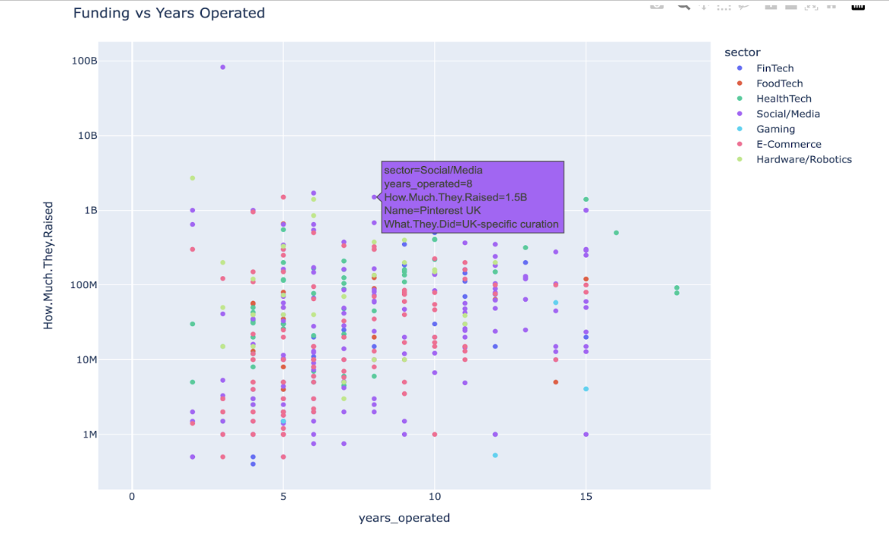
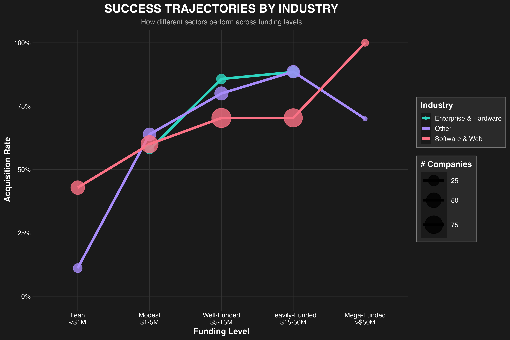
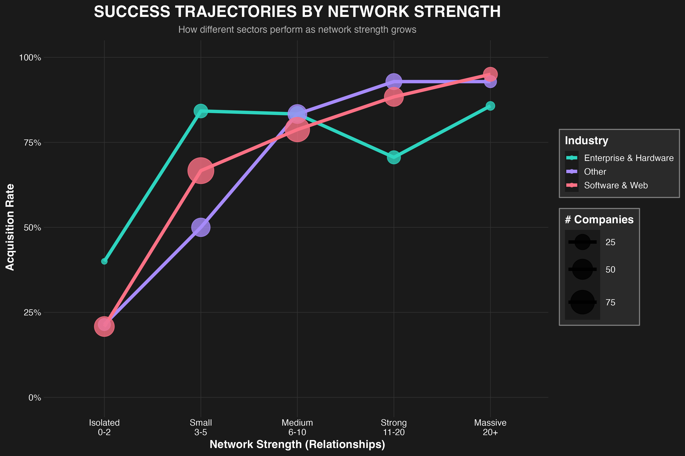
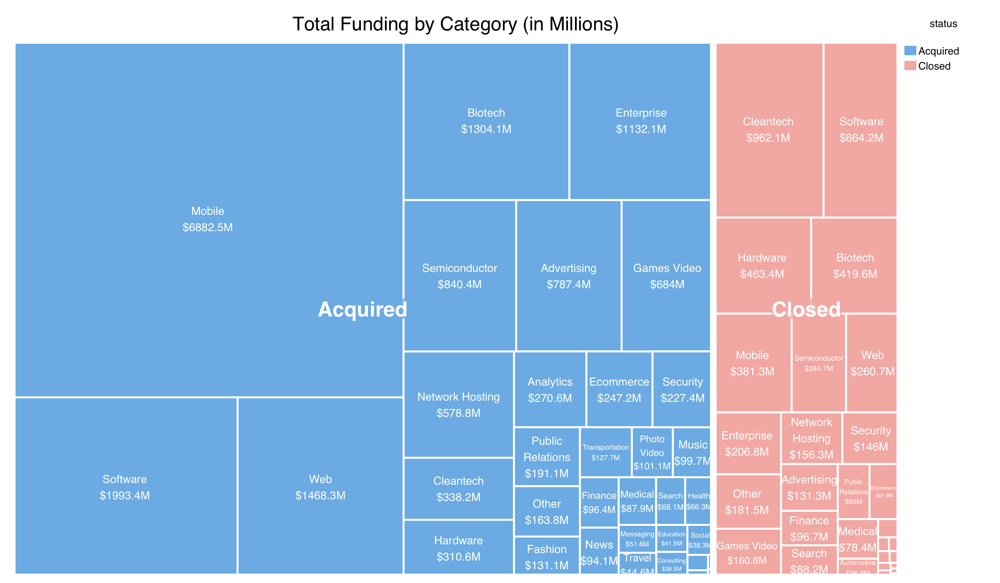
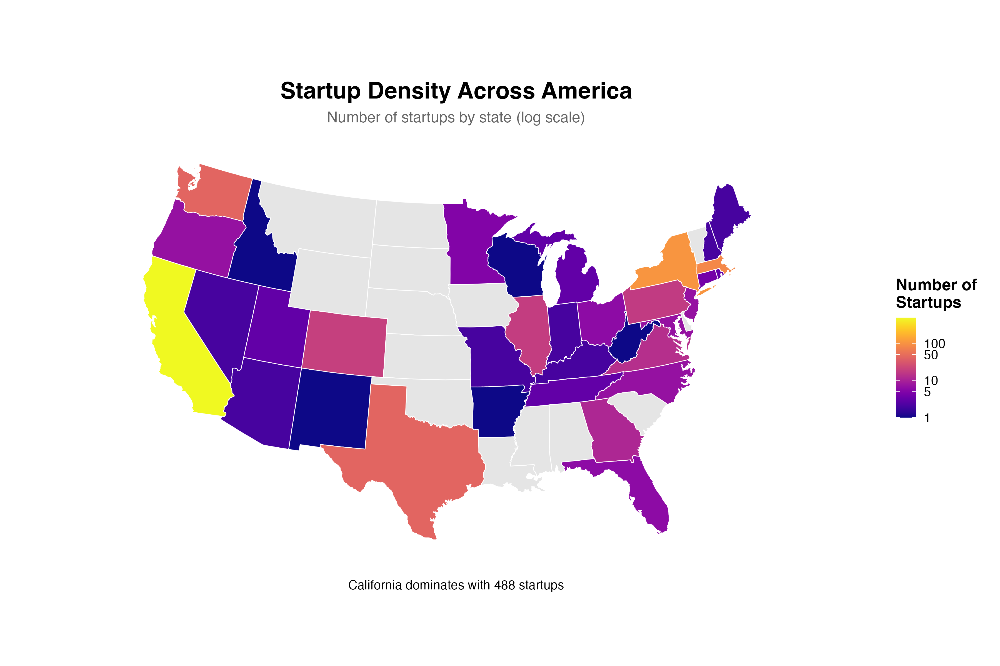
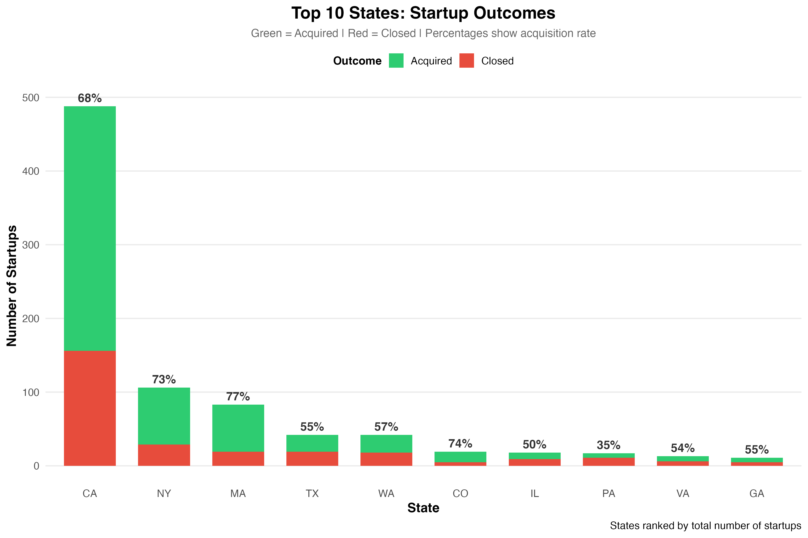
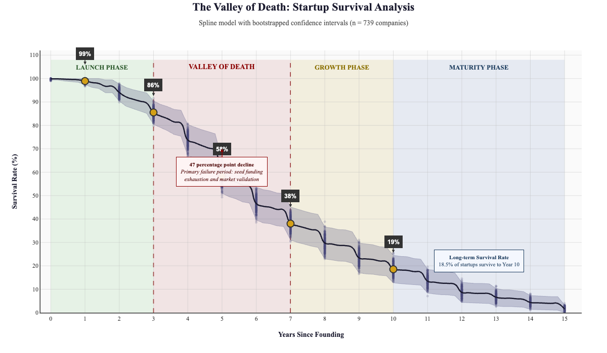

# COGS 108 Final Project

**Title:** Funding, Sector, and Geography as Drivers of Startup Outcomes (Failure vs. Acquisition)

## Team
- Group 141  
- Members: Zahir Ali, Omar Abbasi, Yasir Rizvi, Mostafa Darwish, Adam Hamadene

---

## 1. Overview
We analyze how funding size, industry sector, and geography relate to startup outcomes and timing. Using three public datasets (Crunchbase startup investments, a large Crunchbase-derived corpus, and startup failure records), we:
- Profile outcomes (acquired/IPO vs. closed vs. still operating)
- Analyze relationships between funding, network strength, industry, and geography
- Explore time-to-event dynamics (from founding to acquisition/closure)
- Compare patterns across sectors and locations (e.g., US regions, states, cities)
- Identify the "Valley of Death" period (years 3-7) where startup failure risk is highest

The goal is to quantify associations, highlight robust signals, and document uncertainties/biases common in startup databases.

**Main Analysis**: See `03-FinalProject.ipynb` for the complete analysis, visualizations, and conclusions.

---

## 2. Research Questions
**Primary Research Question**: How do funding size, industry sector, and geographic location influence both the likelihood and timing of startup failure versus acquisition?

**Sub-questions**:
- Q1. Association: How strongly are funding size and intensity (total USD raised, count of rounds) associated with ultimate startup outcomes?
- Q2. Sector/geo effects: Do sector and geography meaningfully shift success vs. failure rates, after controlling for funding intensity?
- Q3. Network effects: How does network strength (relationships with VCs, executives, advisors) relate to funding and success?
- Q4. Timing: How do funding, sector, and geography shift time-to-event (acquisition vs. closure)? What is the "Valley of Death" period?
- Q5. Robustness: Are the above patterns consistent across multiple related datasets with different coverage?

---

## 3. Background & Prior Work
Prior research and practitioner reports note that early funding magnitude and deal cadence correlate with exit likelihood; sector cycles (e.g., consumer vs. enterprise, web/mobile vs. deep tech) and regional ecosystems (e.g., Bay Area vs. others) also shape access to capital and networks. However, Crunchbase-like datasets are subject to reporting biases, inconsistent taxonomies, and lagged event labels. We therefore emphasize transparent cleaning, standardized taxonomies, and sensitivity analyses (e.g., winsorization/log transforms for heavy-tailed funding).

---

## 4. Hypotheses
- H1 (Funding): Greater funding_total_usd and more funding_rounds are associated with higher odds of success (acquisition/IPO) vs. failure (closure).
- H2 (Sector): Certain sectors (e.g., enterprise software) exhibit higher success odds than others after adjusting for funding intensity.
- H3 (Geography): Startups in established ecosystems (e.g., CA/Bay Area) have higher success odds and longer survival times than emerging regions.
- H4 (Timing): Higher funding correlates with longer time-to-event overall, and faster time-to-acquisition conditional on success.

---

## 5. Datasets

### 5.1 Dataset #1 — Crunchbase Startup Investments (to 2015)
- Scope: ~50,000 startup records (39 variables) with details on funding size, industry, location, and company status
- Use: Analysis of funding patterns, top countries by total funding, funding amount distributions, and total VC funding over time
- Key findings: U.S. dominates global funding, most startups raise relatively small amounts, investment activity peaked around 2010–2012
- Limitations: Dataset ends before 2015, limiting relevance for recent startup trends; Crunchbase data is partly self-reported/crowdsourced, prone to missing or biased entries
- Processed files: `data/02-processed/dataset1_cleaned.csv`, `data/02-processed/startup_data.csv`

### 5.2 Dataset #2 — Big Startup Success/Fail Dataset from Crunchbase
- Source: [Kaggle Dataset](https://www.kaggle.com/datasets/yanmaksi/big-startup-secsees-fail-dataset-from-crunchbase)
- Scope: 24,182 observations with 12 variables
- Key variables:
  - Funding-related: `funding_total_usd`, `funding_rounds`, `first_funding_at`, `last_funding_at`
  - Outcome/status: `status` (operating, acquired, closed, ipo)
  - Company profile: `name`, `category_list`, `country_code`, `state_code`, `region`, `city`
  - Timing: `founded_at` and milestone event dates for computing time-to-failure or time-to-acquisition
- Use: Main corpus for modeling and timing analysis; cross-examination with other datasets
- Limitations: Potential label noise (status values may be outdated), missing/inconsistent date fields, possible duplicates, inconsistent industry taxonomy, survivorship and reporting bias
- Processed file: `data/02-processed/CleanData2.csv`

### 5.3 Dataset #3 — Startup Outcomes and Lifespan / Startup Failures
- Scope: ~409 unique observations across multiple industries (Finance, Food, Healthcare, Information Technology, Manufacturing, Retail)
- Variables: Name, Years of Operation, What They Did, How Much They Raised, Why They Failed, Takeaway
- Use: Cross-sector failure and lifespan analysis; detailed failure narratives
- Key findings: Focuses on startups that have failed (1992-2024), providing insights into failure patterns and lifespans
- Limitations: Selection bias (only failed startups, overrepresents well-documented companies), lacks some quantitative details like geographic coordinates
- Processed file: `data/02-processed/dataset3_cleaned.csv`

Manual download links are provided in the notebooks to avoid Google Drive "viewer" HTML downloads.

---

## 6. Methods / Analysis Plan

### 6.1 Data Cleaning & Standardization
- Column normalization to snake_case
- Deduplication (exact and entity-level by `name` where appropriate)
- Currency parsing for `funding_total_usd` (strip $, commas; numeric coercion)
- Date parsing: `founded_at`, `acquired_at`, `closed_at`, `last_funding_at`
- Sector taxonomy: collapse messy `labels`/`category_list` to consistent high-level sectors
- Geography normalization: `country_code`, state/region, and city harmonization
- Outlier handling for funding (IQR flags; sensitivity with winsorization / log1p)
- See `01-DataCheckpoint.ipynb` for detailed data wrangling code

### 6.2 Exploratory Data Analysis (EDA)
- Outcome distributions across sector and geography
- Funding distributions (heavy tails) and relationships with outcome
- Missingness audit and simple missingness correlation map to detect systematic gaps
- Visualizations created in RStudio (see `r_studio_visualization_code/` directory)

**Key Visualizations:**

- **Correlation Analysis**: Correlation heatmap between funding, outcomes, and failure metrics reveals relationships between VC backing, funding rounds, and startup outcomes.

  

- **Funding vs. Years Operated**: Scatter plot showing the relationship between funding amount and years of operation, revealing sector-specific patterns.

  

- See `02-EDACheckpoint.ipynb` and `03-FinalProject.ipynb` for complete analysis details

### 6.3 Key Findings
Based on the analysis in `03-FinalProject.ipynb`:

- **Funding Impact**: Funding size has the strongest positive correlation with success (acquisition vs. closure). Higher funding levels consistently associated with higher acquisition rates across all industry sectors.

  

- **Network Strength**: Even stronger positive correlation than funding alone. Startups with denser connections to notable individuals (board members, VC partners, executives) show sharply higher acquisition rates.

  

- **Industry Sector**: Software, web, and mobile sectors dominate both in total funding and success rates. These technology-based sectors received the most investment capital and showed the highest average success rates.

  

- **Geographic Location**: California dominates the startup landscape with 4x more startups than the next highest state (New York). California's ecosystem (VC firms, accelerators like Y Combinator, Silicon Valley Bank) creates optimal conditions for network building and funding access.

  
  
  

- **Valley of Death**: Survival probability drops significantly between years 3-7 (from 92% to 42%), with year 5 being the deadliest inflection point. 77% of failures cited "Competition" as primary cause, regardless of funding levels.

### 6.4 Time-to-Event Analysis
- Kaplan-Meier Survival Estimator used to model time-to-event probabilities
- Analysis reveals distinct "Valley of Death" survival curve
- Survival summaries compared by sector/geography and funding strata
- See `r_studio_visualization_code/valley_of_death_spline.rmd` for implementation



---


## 7. Limitations
- **Non-causal observational data**: Omitted-variable bias (e.g., team quality, product-market fit) cannot be controlled
- **Taxonomy noise in sectors**: Entity resolution challenges (duplicate or ambiguous names)
- **Geographic heterogeneity**: Conflates ecosystem maturity with regulation/cost structures
- **Time granularity and label lag**: Can distort survival summaries
- **Selection bias**: Datasets overrepresent visible, venture-backed startups and underrepresent smaller startups
- **Network measurement**: Network strength measured through documented relationships, missing less formal relationships
- **Cross-sectional analysis**: Most analyses are cross-sectional, limiting causal inference; survival analysis relies on limited failure data affected by external factors (economic cycles, emerging tech waves)
- **Generalization limits**: Findings may not generalize to non-tech or smaller companies; Kaggle datasets may overrepresent high-success startups

---

## 8. Repository Structure
```text
/
├─ data/
│  ├─ 00-raw/                             # Raw datasets (manual download required)
│  ├─ 01-interim/                         # Intermediate processing files
│  ├─ 02-processed/                       # Cleaned datasets ready for analysis
│  │  ├─ dataset1_cleaned.csv            # Dataset #1 processed
│  │  ├─ startup_data.csv                # Dataset #1 additional data
│  │  ├─ CleanData2.csv                  # Dataset #2 processed
│  │  └─ dataset3_cleaned.csv            # Dataset #3 processed
│  └─ README.md                           # Data directory documentation
├─ images/                                # Generated visualizations
│  ├─ correlation_between_funding_outcomes_and_failure_metrics.png
│  ├─ funding_vs_years_operated.png
│  ├─ startup_density_across_america.png
│  ├─ success_trajectories_by_industry.png
│  ├─ success_trajectories_by_network_strength.png
│  ├─ the_valley_of_death.png
│  ├─ top_10_states_startup_outcomes.png
│  └─ total_funding_by_category.png
├─ modules/
│  └─ get_data.py                        # Utility functions for data loading
├─ r_studio_visualization_code/          # R Markdown files for visualizations
│  ├─ Correlation Heatmap Visualization.rmd
│  ├─ Geographic-StackedBars.Rmd
│  ├─ Industry - Network - State Density.Rmd
│  ├─ SuccessByIndustry.Rmd
│  ├─ SuccessByNetwork.Rmd
│  ├─ TREEMAP.Rmd
│  └─ valley_of_death_spline.rmd
├─ results/                              # Analysis results and outputs
├─ 00-ProjectProposal.ipynb              # Project proposal + initial exploration
├─ 01-DataCheckpoint.ipynb               # Data cleaning and preprocessing
├─ 02-EDACheckpoint.ipynb                # Exploratory data analysis
├─ 03-FinalProject.ipynb                 # Final analysis and conclusions (MAIN)
├─ 2D_Scatter_Plot.ipynb                 # Additional visualization analysis
└─ README.md                             # This file
```

### Visualization Workflow
1. Data processing: Python notebooks (`01-DataCheckpoint.ipynb`, `02-EDACheckpoint.ipynb`)
2. Visualization creation: R Markdown files in `r_studio_visualization_code/`
3. Results display: Images referenced in `03-FinalProject.ipynb` from `images/` directory
